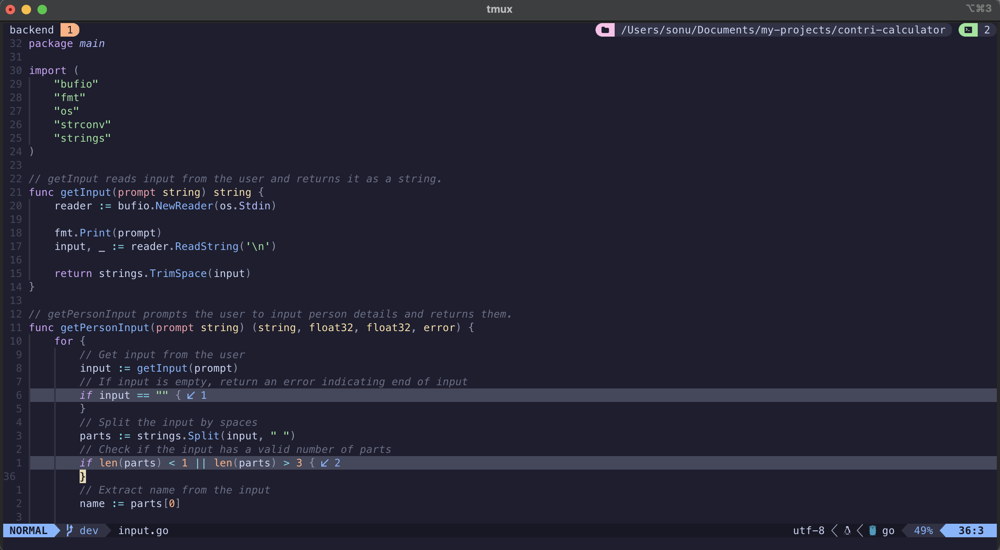

# My Neovim Config

Don't have time to refactor and make it pretty right now (will do when I'm free)

```
Includs:
- Lazy plugin manager
- Colorscheme
- Neo tree
- Lualine
- LSP
- Snippets
- Code Completion
- Formatting and Linting
    etc. etc. etc...
```


